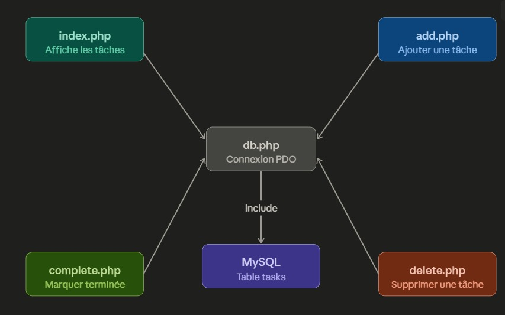

# Todo App PHP

Une petite application de gestion de tâches en PHP avec une base de données MySQL.

## Description

Cette application permet de :
- afficher les tâches en cours et terminées
- ajouter une nouvelle tâche
- marquer une tâche comme terminée
- supprimer une tâche

## Architecture

L’application est structurée de manière simple :
- `db.php` gère la connexion PDO à la base de données MySQL
- `index.php` affiche les tâches et les actions possibles
- `add.php` ajoute une nouvelle tâche
- `complete.php` marque une tâche comme terminée
- `delete.php` supprime une tâche



> Placez votre image d'architecture dans le dossier racine sous le nom `architecture.png`.

## Installation

1. Copiez le projet dans `htdocs` de XAMPP.
2. Créez une base de données MySQL nommée `todo`.
3. Exécutez le script SQL pour créer la table `tasks` :

```sql
CREATE TABLE tasks (
  id INT AUTO_INCREMENT PRIMARY KEY,
  title VARCHAR(255) NOT NULL,
  status ENUM('pending','done') NOT NULL DEFAULT 'pending',
  created_at TIMESTAMP DEFAULT CURRENT_TIMESTAMP
);
```

4. Configurez les paramètres de connexion dans `db.php` si nécessaire.
5. Ouvrez `http://localhost/todo-app/index.php`.

## Utilisation

- Cliquez sur **Ajouter une tâche** pour créer une nouvelle tâche.
- Cliquez sur **Terminer** pour passer une tâche en statut terminé.
- Cliquez sur **Supprimer** pour supprimer une tâche.

## Remarques

Ce projet est conçu comme une application d’exemple simple et peut être étendu avec :
- validation des formulaires
- interface responsive améliorée
- authentification utilisateur
- filtres et recherche de tâches
